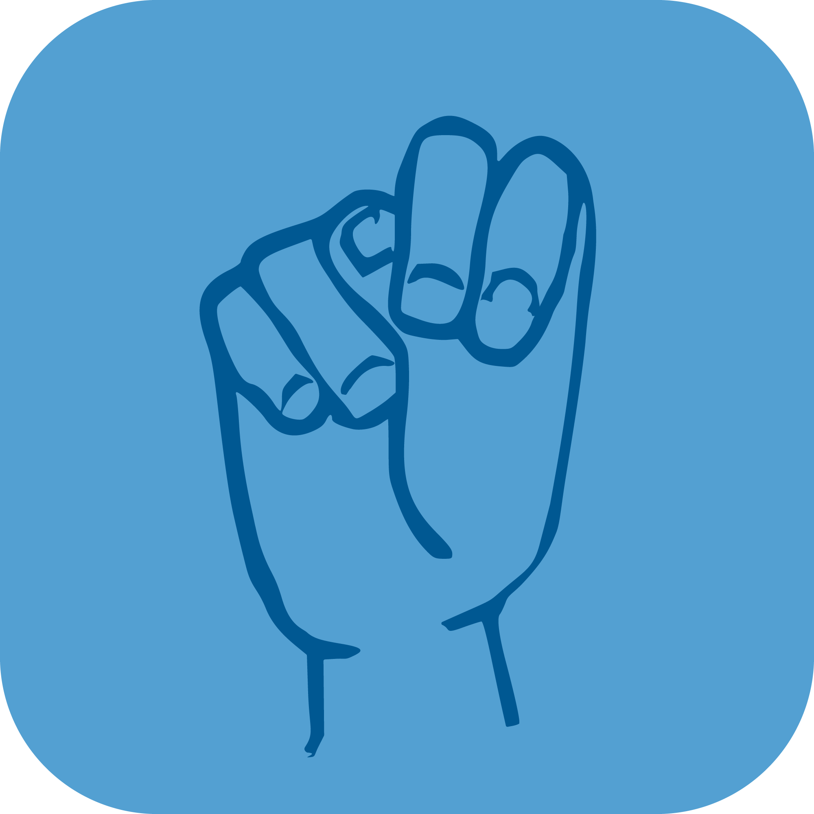

 

# **Tegnordbok**

En moderne ordbokapp for Norsk tegnspråk med åpen kildekode.

## Bruk av eksterne tjenester

Appen henter og viser ordbokdata fra Statpeds [Tegnordbok](https://www.minetegn.no/Tegnordbok-2016/tegnordbok.php) og [TegnWiki](https://www.minetegn.no/tegnordbok/tegnwiki/) og henter YouTube-videoer gjennom [Piped.video](https://piped.video).

## Lisens

Tegnordbok-appen er fri programvare (Free Software). Du kan bruke, studere, dele og forbedre den etter eget ønske. Spesifikt kan du redistribuere og/eller modifisere den i henhold til vilkårene i [GNU General Public License version 3](https://www.gnu.org/licenses/gpl-3.0.en.html) slik den er publisert av Free Software Foundation.
